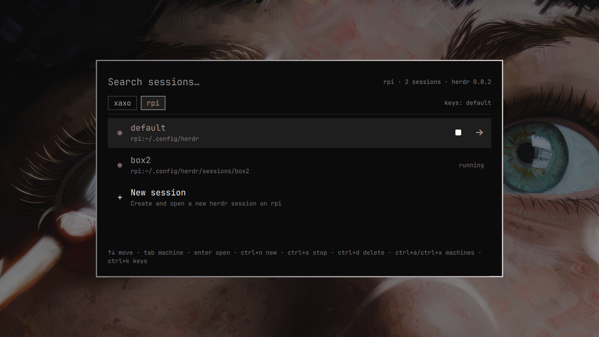

# Herdr Session Manager for Omarchy

Interactive session picker, launcher, and manager for [Herdr](https://herdr.dev) AI coding agent sessions.



Requires [herdr](https://herdr.dev) (ships with Omarchy).

---

### Step 1: Install

```bash
omarchy plugin add https://github.com/houtvongsak/omarchy-herdr-sessions.git --enable
```

---

### Step 2: Add Shortcut

Run this command in your terminal to bind **`Super + Ctrl + Enter`**:

```bash
cat << 'EOF' >> ~/.config/hypr/bindings.lua

-- Herdr Session Picker
hl.unbind("SUPER + CTRL + RETURN")
o.bind("SUPER + CTRL + RETURN", "Herdr Session Manager", "omarchy-shell shell toggle io.github.houtvongsak.herdr-sessions")
EOF
hyprctl reload
```

*(Or edit manually with `nano ~/.config/hypr/bindings.lua` and run `hyprctl reload`).*

---

### Step 3: Use It

Press **`Super + Ctrl + Enter`**. Each machine has a tab, this computer first, named by host name as herdr shows it. Every herdr session on it is listed, running or stopped. A session that a herdr window on this computer is showing is lit and marked **open here**; the rest are dimmer.

Type to search the current machine's sessions. The keys:

| Key | Action |
|---|---|
| `↑` / `↓` | Previous / next session |
| `Tab` / `Shift+Tab` (or `→` / `←`) | Next / previous machine |
| `Enter` | Open the session (a stopped one starts again) |
| `Ctrl+N` | New session on this machine |
| `Ctrl+S` | Stop the session |
| `Ctrl+D` / `Delete` | Delete a stopped session |
| `Ctrl+A` / `Ctrl+X` | Add a machine / remove this machine's tab |
| `Ctrl+R` | Refresh |
| `Ctrl+K` | Switch between default and vim keys |
| `Esc` | Clear the search, then close |

#### Your own keys

The first time the picker opens (or after updating from a version without this), it asks once: **Default** (type to search) or **Vim** (`hjkl`, `/` to search). Your answer is saved to `~/.config/herdr-sessions/keys.json`. Switch any time with `Ctrl+K` or by clicking **keys:** next to the tabs. Edit the file to change any action; the picker picks it up as soon as you save, and the footer points out keys that clash or can't fire.

```json
{
  "preset": "vim",
  "keys": {
    "stop": ["ctrl+s"],
    "newSession": ["n", "ctrl+n"]
  }
}
```

- **Presets:** `default` (above, type to search) or `vim` (`j`/`k` sessions, `h`/`l` machines, `/` to search, and single letters `n` `s` `d` `a` `x` `r` for the actions).
- **Actions:** `up`, `down`, `nextMachine`, `prevMachine`, `open`, `search`, `newSession`, `stop`, `delete`, `addMachine`, `removeMachine`, `refresh`, `switchKeys`.
- **Keys:** a letter or digit, a symbol like `/`, or `up` `down` `left` `right` `tab` `return` `delete` `backspace` `space` `home` `end` `pageup` `pagedown`, with any of `ctrl+` `alt+` `shift+` in front.
- `"typeToSearch": true` keeps type-to-search with any preset. Avoid binding bare letters then, as they'd only ever type.

---

### Other Machines

The picker looks for sessions on every machine in `~/.config/herdr-sessions/machines`, one SSH target per line (`user@host` or a `Host` from `~/.ssh/config`), plus any machine saved with `herdr machine add`:

```
# ~/.config/herdr-sessions/machines
you@buildbox
desktop
```

- Adding a machine in the picker adds a line; removing one deletes its line. A machine saved in herdr gets a `-target` line instead, which hides it here and leaves herdr's own list alone.
- Targets can be `user@host`, a `Host` from `~/.ssh/config`, or `ssh://user@host:port`.
- This computer is skipped, so one list can be shared by all your machines.
- Each tab shows that machine's herdr version, flagged when it differs from this computer's: an older client can't always attach to a newer server. If opening a session fails, the terminal stays open with herdr's error.
- Each machine needs SSH that doesn't prompt (a key or agent) and herdr; `~/.local/bin`, where herdr installs itself, is searched.
- Sessions are read with `herdr session list --json` over SSH, all machines at once. Opening one runs `herdr --remote <target> [--session <name>]` in a terminal; stop and delete run `herdr session stop|delete` over SSH.

---

### Removal

Remove the plugin and restore the original `Super + Ctrl + Enter` (opens default herdr):

```bash
omarchy plugin remove io.github.houtvongsak.herdr-sessions
sed -i '/^-- Herdr Session Picker$/,/herdr-sessions")$/d' ~/.config/hypr/bindings.lua
hyprctl reload
```

### License

MIT
